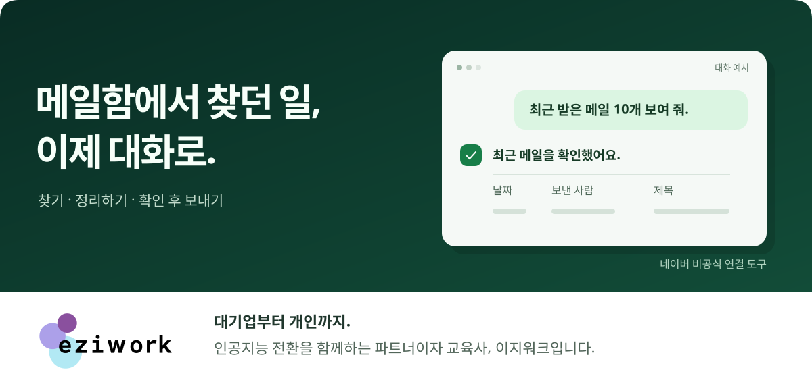
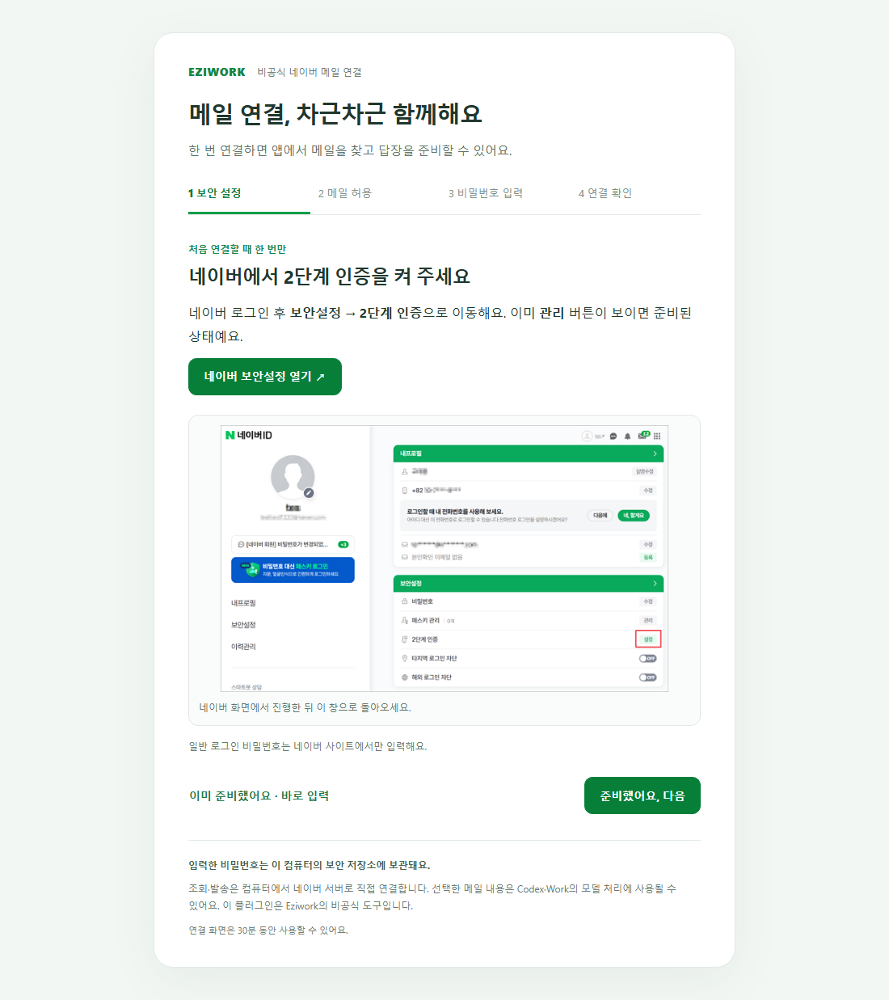

<p align="center">
  
</p>

<h1 align="center">네이버 메일, 이제 대화로.</h1>

<p align="center">찾고 싶은 메일을 말하고, 필요한 내용만 정리하고, 확인한 뒤 보내세요.<br>Codex와 로컬 MCP를 지원하는 데스크톱 Work를 위한 이지워크 플러그인.</p>

<p align="center">
  <a href="#바로-시작하기">바로 시작하기</a> ·
  <a href="docs/EXAMPLES.md">활용 예시</a> ·
  <a href="docs/USER_GUIDE.md">연결 가이드</a> ·
  <a href="https://github.com/eziwork/naver-mail/releases">다운로드</a>
</p>

> **현재 v0.2.1 사전 배포판입니다.** Windows x64·Mac Intel·Apple Silicon 패키지를 제공합니다. Mac의 실제 앱 검증과 코드서명·공증은 남아 있습니다. [검증 범위 보기](RELEASE.md)
>
> Eziwork가 만든 **비공식 연결 도구**이며 NAVER 공식 제품이 아닙니다. 메일 서버에는 내 컴퓨터에서 직접 연결하고, 요청 결과에 포함된 메일 정보는 AI 서비스에서 처리됩니다.

## 이런 순간에 부탁해 보세요

| 이런 일이 필요할 때 | 이렇게 말해 보세요 |
| --- | --- |
| 하루 업무를 시작할 때 | “최근 받은 메일 10개를 보여 줘.” |
| 예전 자료를 찾아야 할 때 | “지난달 받은 메일 중 제목에 ‘계약’이 있는 메일을 찾아 줘.” |
| 여러 메일을 읽고 정리할 때 | “이 세 메일에서 일정과 내가 할 일을 정리해 줘.” |
| 첨부파일을 받아야 할 때 | “이 메일의 PDF 첨부파일을 저장해 줘.” |
| 답장을 준비할 때 | “이 메일에 답장을 작성하고 보내기 전에 전체 내용을 보여 줘.” |

**본문을 조회해도 읽음 상태는 그대로. 발송은 전체 내용을 검토하고 다음 메시지에서 확인한 뒤에.** 읽음 표시를 바꾸거나 첨부파일을 저장할 때도 직접 요청합니다. [복사해서 쓰는 활용 예시 →](docs/EXAMPLES.md)

## 바로 시작하기

### 01 · 설치를 부탁하세요

Codex의 로컬 작업 또는 로컬 MCP를 지원하는 데스크톱 Work에 아래 두 줄을 붙여 넣으세요.

```text
https://github.com/eziwork/naver-mail
이 플러그인을 설치해 줘.
```

AI가 [설치 도우미 지침](docs/INSTALL_FROM_GITHUB.md)에 따라 내 컴퓨터에 맞는 배포 파일을 확인하고 설치를 진행합니다. Node·npm·Rust를 따로 설치할 필요는 없습니다. 앱의 로컬 플러그인 지원과 조직 정책에 따라 설치 가능 여부가 달라집니다.

### 02 · 네이버 계정을 연결하세요

설치 후 **새 작업**을 시작하고 다음과 같이 요청하세요.

```text
네이버 메일 연결해 줘.
```

열린 로컬 안내 화면을 따라 **2단계 인증 → IMAP/SMTP 허용 → 앱 비밀번호 입력 → 연결 확인**을 진행합니다. 비밀번호는 이 화면에서만 입력하고 대화창에는 붙여 넣지 마세요. 이미 보안 설정을 마쳤다면 바로 입력 단계로 이동할 수 있습니다.

<details>
<summary>연결 화면 미리 보기</summary>



화면 예시는 가상 계정으로 촬영했습니다. [단계별 연결 가이드](docs/USER_GUIDE.md#네이버-계정-연결하기)

</details>

### 03 · 첫 메일을 확인하세요

```text
받은메일함 최근 메일 10개를 보여 줘.
```

목록에서 필요한 메일을 골라 “두 번째 메일 내용을 정리해 줘”처럼 이어서 요청하세요. 계정 연결을 마친 것만으로 앱을 다시 시작할 필요는 없습니다.

<details>
<summary>설치가 안 되거나 연결 창이 보이지 않아요</summary>

- **설치 직후 도구가 안 보이면:** 새 작업을 먼저 시작하세요. 그래도 없을 때 앱을 다시 시작합니다.
- **브라우저가 안 열리면:** 대화에 나온 로컬 연결 링크를 누르세요. 링크는 공유하지 마세요.
- **연결 화면이 만료되면:** “네이버 메일 연결 화면을 다시 열어 줘”라고 요청하세요. 화면의 유효기간은 최초 생성부터 30분입니다.
- **주소로 설치할 수 없는 환경이면:** [수동 설치 안내](docs/USER_GUIDE.md#수동-설치가-필요한-경우)를 따라주세요. GitHub의 **Code → Download ZIP**과 **Source code**는 일반 설치용 파일이 아닙니다.

[원인별 문제 해결 →](docs/TROUBLESHOOTING.md)

</details>

## 보내기 전, 한 번 더 확인

| 순서 | 내가 하는 일 |
| --- | --- |
| **작성** | 수신자와 전달할 내용을 알려 주고 초안을 요청합니다. |
| **검토** | 보내는 주소, 받는 사람·참조·숨은 참조, 제목, 전체 본문, 첨부파일을 확인합니다. |
| **발송 확인** | 내용이 맞으면 **다음 메시지에서** “이 내용으로 보내 줘”라고 요청합니다. |

발송 준비 내용은 최대 10분 동안 유지됩니다. 결과가 불명확하면 자동으로 다시 보내지 않고, 보낸메일함이나 수신 여부를 먼저 확인하도록 안내합니다. SMTP 서버의 접수 성공이 최종 수신함 도착을 보장하지는 않습니다.

## 내 정보는 어디로 가나요?

| 정보 | 처리 위치 |
| --- | --- |
| 앱 비밀번호 | 내 PC의 Windows 자격 증명 관리자 또는 macOS 키체인 |
| 메일 조회·발송 통신 | 내 PC ↔ 네이버 IMAP·SMTP 서버 |
| 선택한 메일의 제목·본문 등 | 요청 결과로 Codex/Work에 반환되어 AI 처리에 사용 |
| 저장을 요청한 첨부파일 | 다운로드 폴더의 `Naver Mail Attachments` |

Eziwork의 메일 수집 서버나 원격 사용량 추적 기능은 없습니다. **로컬 연결은 AI 분석까지 오프라인이라는 뜻은 아닙니다.** 대화와 메일 정보의 보관에는 사용하는 AI 서비스의 정책이 적용됩니다. [보안 경계 자세히 보기](SECURITY.md)

## 설치 전에 알아두세요

| 환경·기능 | 현재 범위 |
| --- | --- |
| Windows x64 | 로컬 실행·실제 IMAP/SMTP 인증 검증, 배포 패키지 제공 |
| Mac Intel / Apple Silicon | 패키지·플랫폼별 CI 통과. v0.2.1 실제 앱·키체인·Safari 추가 검증 필요 |
| Codex / 로컬 MCP 지원 데스크톱 Work | 대상 환경. 앱 기능과 조직 정책에 따름 |
| 웹·클라우드 Work / 모바일 | 지원 범위에 포함하지 않음 |
| 계정·실행 방식 | 계정 하나 연결, 사용자가 요청할 때 조회·발송 |
| 상시 감시·예약 발송·메일 삭제·이동 | 제공하지 않음 |

코드서명·macOS 공증과 실제 메일 발송 검증은 아직 완료되지 않았습니다. 팀원의 v0.2.0 Mac 연결 성공 제보와 v0.2.1 CI 결과는 [배포 기록](RELEASE.md)에서 구분해 확인할 수 있습니다.

## 자주 묻는 질문

<details>
<summary>네이버가 허용한 연결 방식인가요?</summary>

IMAP·SMTP는 네이버가 [공식 안내](https://help.naver.com/service/30029/contents/21351?osType=COMMONOS)하는 외부 메일 연결 방식입니다. 이 플러그인은 앱 비밀번호로 해당 서버에 연결합니다.

다만 프로토콜 지원이 이 AI 플러그인에 대한 개별 승인이나 모든 자동화의 허용을 뜻하지는 않습니다. [이용약관](https://policy.naver.com/rules/service.html)의 자동화·남용 제한과 [메일 발송 제한](https://help.naver.com/service/30029/contents/21159)이 적용됩니다. 공개 안내만으로 AI 도구의 허용 범위를 확정할 수 없으며, 무인·대량 발송 등으로 사용 범위를 넓히려면 네이버에 확인하세요. 공식 문서 확인일: 2026-10-01.

</details>

<details>
<summary>설치 전 메일도 찾을 수 있나요?</summary>

네이버 서버에 남아 있는 메일은 설치 전 메일도 검색할 수 있습니다. 실제 조회 범위는 네이버의 IMAP 동기화 제한과 메일 보관 상태에 따라 달라집니다.

</details>

<details>
<summary>계정을 바꾸거나 연결을 해제하려면요?</summary>

“네이버 메일 계정을 다시 연결해 줘” 또는 “네이버 메일 연결 해제해 줘”라고 요청하세요. 연결 해제는 이 컴퓨터에 저장된 인증정보를 삭제합니다. 네이버 보안설정에서 해당 앱 비밀번호를 삭제하면 네이버 측 접근 권한도 폐기할 수 있습니다. 플러그인 제거만으로 저장된 인증정보가 삭제되지는 않습니다.

</details>

<details>
<summary>컴퓨터가 꺼져 있어도 동작하나요? 대기 중에는 무겁지 않나요?</summary>

컴퓨터와 호스트 앱이 실행 중이어야 합니다. 실제 요청 때 Node 작업 프로세스를 시작하고 작업·설정 화면·유효한 발송 계획이 없으면 30초 유휴 후 종료합니다. 작은 Rust 중계는 대기합니다.

Windows 호스트 런타임·MCP 연결 1개·5회 반복 측정에서 v0.2.1의 최대 대기 작업 집합은 **6.95 MiB**, Node 준비 시간은 **525–585ms**였습니다. Eziwork의 자체 측정이며 네이버 통신 시간은 제외합니다. [측정 원본](docs/measurements/windows-0.2.1.json) · [구조와 측정 조건](docs/ARCHITECTURE.md)

</details>

## 더 알아보기

| 사용 안내 | 개발·운영 |
| --- | --- |
| [연결 가이드](docs/USER_GUIDE.md) · [활용 예시](docs/EXAMPLES.md) | [동작 원리](docs/ARCHITECTURE.md) · [12개 MCP 도구](docs/TOOLS.md) |
| [문제 해결](docs/TROUBLESHOOTING.md) · [다운로드](https://github.com/eziwork/naver-mail/releases) | [빌드·테스트](docs/DEVELOPMENT.md) · [개발 참여](CONTRIBUTING.md) |
| [변경 이력](CHANGELOG.md) | [검증 기록](RELEASE.md) · [보안 경계](SECURITY.md) |

문제가 있다면 [Issues](https://github.com/eziwork/naver-mail/issues)에 운영체제, 버전, 오류 문구와 재현 순서를 알려 주세요. 메일 원문·실제 주소·비밀번호·일회성 연결 URL은 제외해 주세요.

---

<p align="center"><a href="https://github.com/eziwork">이지워크</a>는 대기업부터 개인까지 함께하는 B2B AX 파트너사이자 교육사입니다.</p>
