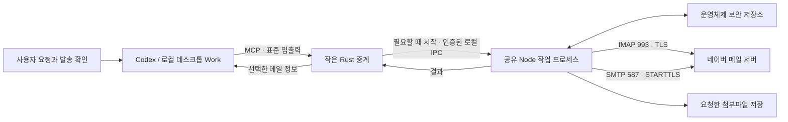
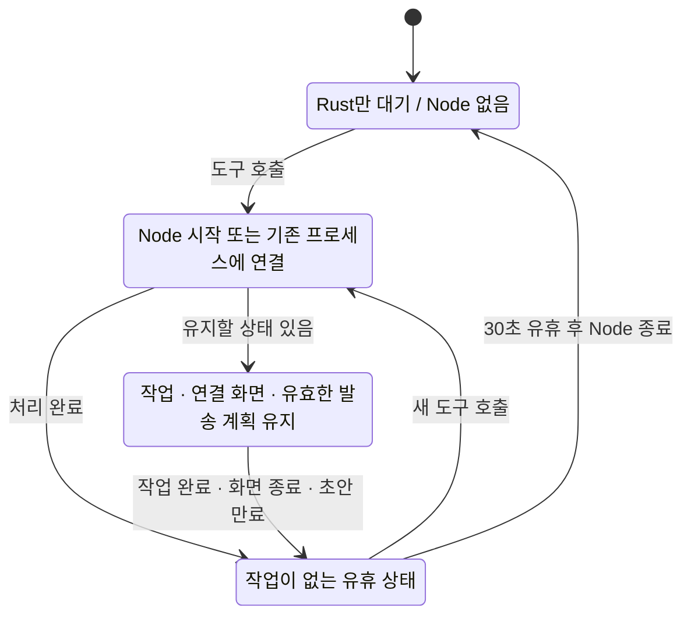
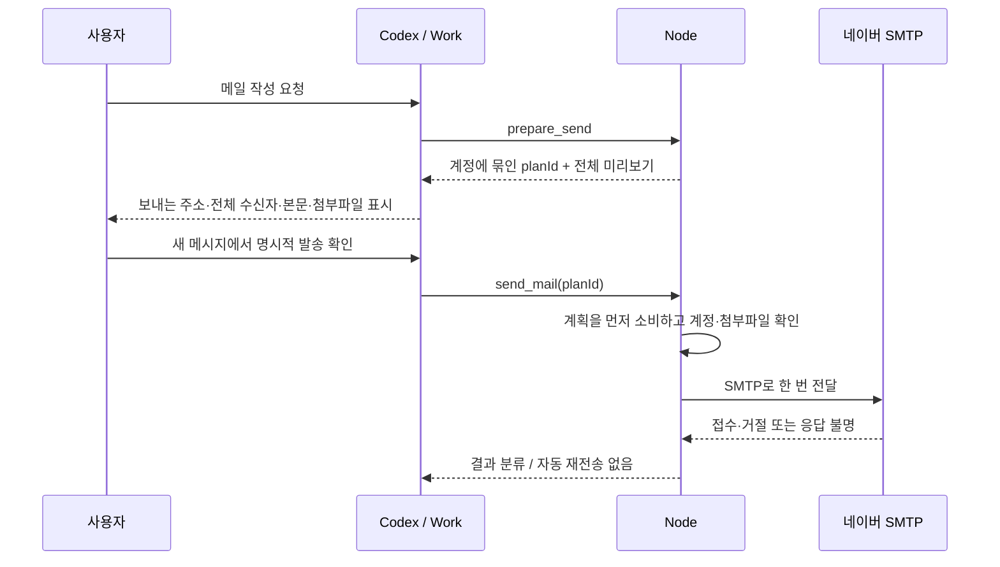

# 동작 원리와 설계

[README](../README.md) · [개발과 배포](DEVELOPMENT.md) · [MCP 도구](TOOLS.md) · [보안 정책](../SECURITY.md)

## 먼저, 쉬운 설명

플러그인은 AI가 네이버 메일을 다루기 위해 사용하는 내 컴퓨터의 도구입니다. AI가 “메일을 검색해 달라”는 요청을 도구 호출로 바꾸면, 작은 중계 프로그램이 실제 메일 프로그램을 깨웁니다. 메일 프로그램은 네이버와 통신해 결과를 돌려주고, 할 일이 없으면 종료됩니다.

**MCP**는 AI 앱과 도구 사이의 공통 통신 규칙입니다. **IMAP**은 네이버에 저장된 메일을 조회하는 규칙, **SMTP**는 메일을 발송하는 규칙입니다. **키링**은 Windows 자격 증명 관리자와 macOS 키체인처럼 운영체제가 제공하는 비밀번호 보관소입니다.

Eziwork 운영 서버는 이 경로에 없습니다. 다만 도구 결과에 담긴 메일 정보는 호스트 AI 앱으로 전달됩니다. “로컬 연결”은 모든 메일 분석이 오프라인에서 이루어진다는 뜻이 아닙니다.

## 구성요소와 코드 위치

| 구성 | 역할 | 코드 |
| --- | --- | --- |
| 플러그인 명세 | 이름·설명·아이콘·스킬·MCP 실행 설정 | [manifest](../.codex-plugin/plugin.json), [.mcp.json](../.mcp.json) |
| 사용 지침 | 메일 선택·불신 데이터 처리·별도 발송 확인 | [SKILL.md](../skills/naver-mail/SKILL.md) |
| Rust 중계 | MCP 초기화·목록·ping, Node 시작·인증·요청 전달 | [main.rs](../native/src/main.rs) |
| 설치 도우미 | 공식 Release 선택·검증·설치·CLI 등록·실패 복구 후 종료 | [installer/main.rs](../installer/src/main.rs) |
| Node 진입점 | IPC 서버, 공유 상태, 유휴 종료 | [worker.ts](../src/worker.ts) |
| 도구 정의 | 12개 도구의 Zod 입력 스키마·핸들러 | [server.ts](../src/server.ts) |
| 작업 제어 | 요청 직렬화·취소·시간 제한 | [operation.ts](../src/operation.ts) |
| 계정 연결 UI | 로컬 HTTP 세션·브라우저 실행·인증·저장 | [setup-session.ts](../src/setup-session.ts), [setup-page.ts](../src/setup-page.ts) |
| 메일 처리 | 검색·본문·첨부파일·읽음 상태 | [mail-service.ts](../src/mail-service.ts) |
| 네이버 통신 | ImapFlow·Nodemailer, TLS·접속 종료·발송 결과 | [naver-client.ts](../src/naver-client.ts) |
| 발송 계획 | 계정에 묶인 단일 사용 계획·만료·파일 검증 | [send-plan.ts](../src/send-plan.ts) |
| OS 차이 | 키링·다운로드 위치·첨부파일 표시 | [credentials.ts](../src/credentials.ts), [platform.ts](../src/platform.ts) |

## MCP 중계와 도구 목록

Rust는 공식 `rmcp` SDK, Node는 공식 TypeScript MCP SDK를 사용합니다. 호스트 앱은 `.mcp.json`의 상대 실행 경로로 Rust 중계를 시작합니다. Windows는 `.exe`, macOS는 해당 아키텍처의 실행 파일을 패키지에 제공합니다.

`initialize`, `tools/list`, `ping`은 Rust에서 끝납니다. 이때 Node를 띄우거나 네이버에 접속하지 않습니다. 반면 `connection_status`를 포함한 실제 `tools/call`은 Node를 시작할 수 있습니다. `connection_status(verify:false)`는 보안 저장소만 확인하고, `verify:true`는 네이버까지 인증합니다.

도구 정의의 원본은 `src/server.ts` 한 곳입니다. `npm run build`가 TypeScript를 컴파일한 뒤 `scripts/generate-catalog.mjs`에서 메모리 내 MCP 연결로 목록을 추출합니다. `dist/tool-catalog.json`을 Rust 빌드에 포함하므로 Node 핸들러와 중계의 도구 목록을 따로 작성하지 않습니다. **TypeScript 빌드 → Rust 빌드** 순서를 지켜야 합니다.

## Node 수명과 메모리

호스트의 MCP 연결마다 Rust 중계는 하나씩 생길 수 있습니다. 여러 중계는 **같은 OS 사용자와 플러그인 버전당 하나의 Node 작업 프로세스**를 공유합니다. 계정·설정 세션·발송 계획·작업 큐가 이 프로세스에 있습니다.

유휴 종료는 MCP 연결을 끊지 않습니다. 호스트와 Rust의 연결은 남아 있으므로 다음 도구 호출에서 새 Node를 시작할 수 있습니다. 네이버 IMAP 연결은 각 작업이 끝날 때 닫으며 IMAP IDLE 감시는 사용하지 않습니다.

| 상태·제한 | 값 | 이유 |
| --- | --- | --- |
| Node 유휴 종료 | 30초 | 연속 요청은 재사용하고 장기 대기 메모리 해제 |
| 연결 설정 세션 | 30분 | 사용자가 네이버 설정을 진행할 시간 확보 |
| 연결 성공 화면 | 최대 60초, 최초 30분 내 | 완료 확인 후 설정 서버 정리 |
| 발송 계획 | 10분, 최대 20개 | 확인 대기 상태 유지와 메모리 상한 |
| 작업 큐 | 최대 20개 | 여러 클라이언트의 동시 요청 제한 |
| Node 작업 제한 | 110초 | 멈춘 요청의 자원 회수 |
| Rust 전달 제한 / 호스트 도구 제한 | 115초 / 120초 | 하위 작업 종료 시간을 확보 |

계획 만료 타이머가 메모리에서 항목을 삭제합니다. 이후 추가 요청이 없어도 만료 처리가 됩니다. 프로세스 강제 종료 시 메모리의 초안은 복구하지 않으며, 계정 비밀번호만 OS 키링에 남습니다.

Windows에서 연결 1개·5회 반복·실제 30초 유휴 조건으로 최대 7.56 MiB를 측정했습니다. 이는 작업 집합 합계이고 네이버 통신 시간은 준비 시간 측정에서 제외합니다. Mac의 RSS는 다른 지표이므로 숫자를 같은 의미로 단순 비교하지 않습니다. [측정값](measurements/windows-0.2.0.json)을 함께 확인하세요.

v0.2.1의 Windows 재측정은 대기 최대 6.95 MiB, Node 준비 525–585ms, 30초 유휴 후 Node 0개였습니다. [원본 측정값](measurements/windows-0.2.1.json)은 호스트 런타임을 사용한 격리 테스트이며 CI에서는 동봉 런타임으로 따로 측정합니다.

macOS에서 Rust는 `pre_exec` 안에서 `setsid()`를 호출해 Node를 부모의 세션·프로세스 그룹에서 분리합니다. 표준 입출력도 분리합니다. 공유 작업 프로세스가 설정 서버를 소유하며, 설정을 처음 연 시점의 30분 마감은 반복 호출이나 상태 조회로 연장하지 않습니다. 성공 뒤 최대 60초 또는 취소·만료까지 유지하고, 다른 작업·초안이 없으면 30초 후 Node를 종료합니다. OS 재부팅·강제 종료 후 설정 복원은 지원하지 않습니다.

화면은 상태 조회만 자동 재시도합니다. 같은 유효 세션에서 이메일과 진행 단계는 `sessionStorage`로 복원하지만 비밀번호는 저장하지 않습니다. 완료·취소·만료 시 임시 정보를 지웁니다. 진단 기록 `lifecycle.jsonl`과 `worker-lifecycle.jsonl`은 각각 약 32KiB로 제한하며 시각·실행 방식·종료 분류/코드만 남깁니다.

## 로컬 IPC와 프로세스 시작 경쟁

Windows는 named pipe, macOS는 Unix domain socket을 사용합니다. 시작 잠금으로 여러 중계가 동시에 Node를 띄우는 경쟁을 막고, IPC에 연결한 뒤 정확한 버전을 확인합니다. 서로 다른 버전은 다른 런타임 디렉터리를 사용합니다.

| 항목 | Windows | macOS |
| --- | --- | --- |
| 상태 디렉터리 | `%LOCALAPPDATA%/Eziwork/NaverMail/<version>` | `~/Library/Application Support/Eziwork/NaverMail/<version>` |
| IPC | 사용자·버전에서 정한 named pipe | 보호된 디렉터리의 Unix socket |
| 디렉터리·비밀값 보호 | 소유자와 SYSTEM에 한정한 보호 DACL | 디렉터리 0700, 소켓·비밀값 0600 |
| 남은 파일 처리 | reparse point 거부 | 시작 잠금 아래 소켓 유형·소유권 확인 후 정리 |

IPC 인증은 무작위 nonce와 HMAC으로 양쪽을 확인합니다. `ipc-secret`은 네이버 비밀번호와 별개의 로컬 통신 비밀값입니다. `worker.json`에는 PID와 버전만 기록합니다. 이 파일들 및 시작 잠금은 계정 저장소가 아닙니다.

같은 OS 사용자 권한으로 실행되는 악성 프로그램까지 격리하는 샌드박스는 아닙니다. Windows의 pipe 이름을 아는 것만으로 정상 도구 호출이 가능한 것은 아니지만, 같은 사용자 권한을 얻은 프로그램은 보안 경계 안에 들어옵니다.

Node는 호스트가 제공한 절대 경로 `CODEX_MCP_NODE_PATH`를 우선 사용하고, 사용할 경로가 없으면 패키지의 고정 버전 런타임을 사용합니다. Windows에서는 콘솔 창을 띄우지 않습니다. 누락된 패키지 파일은 실행 오류로 안내합니다.

## 메일 조회 흐름

1. 요청 시 OS 키링에서 계정 정보를 읽습니다.
2. `imap.naver.com:993`에 TLS로 연결하고 인증합니다.
3. 요청한 메일함을 잠그고 검색 또는 필요한 본문·첨부파일을 읽습니다.
4. 결과를 정리한 뒤 잠금을 해제하고 IMAP 연결을 닫습니다.

`get_mail_batch`는 동일 메일함의 최대 10개 UID를 **한 번의 IMAP 연결과 한 번의 읽기 전용 메일함 잠금**으로 처리합니다. 각 메일을 별도로 로그인하던 비용을 없앴습니다. 본문은 PEEK 방식으로 읽으므로 읽음 플래그를 바꾸지 않습니다.

HTML을 일반 텍스트로 변환하고 원격 이미지·스크립트를 실행하지 않습니다. 발신 인증 헤더와 의심스러운 지시문 신호를 반환하지만, 이를 독립적인 발신자 신원 증명이나 완벽한 악성 메일 판정으로 취급하지 않습니다.

## 연결 화면과 비밀번호 저장

`open_setup`은 필요할 때만 `127.0.0.1` HTTP 서버를 열고 임의 토큰을 포함한 주소를 반환합니다. Host·Origin·토큰을 확인하며, 브라우저 코드와 스타일은 로컬 정적 파일만 허용하는 CSP를 적용합니다. 비밀번호를 URL, 로그, MCP 인수, 브라우저 저장소에 기록하지 않습니다.

설정 화면은 네이버 보안 설정과 메일 연동 허용을 안내하고 주소·앱 비밀번호를 받습니다. IMAP 인증 → SMTP 인증 → OS 키링 저장이 성공해야 완료됩니다. 중복 제출을 막고 인증·네트워크·보안 저장소 오류를 나눠 안내합니다. 브라우저 실행에 실패해도 연결 주소를 반환해 사용자가 직접 열 수 있습니다.

저장 레코드는 서비스 `com.eziwork.codex.naver-mail`, 계정 `default`, schema version 1입니다. 기존 저장 형식을 유지합니다. 새 계정 저장과 발송 계획 무효화는 공유 큐에서 진행합니다. 키링 접근이 실패하면 평문 저장으로 우회하지 않습니다.

## 발송과 중복 방지

발송 계획에 보내는 계정을 저장하고 발송 시 현재 계정과 대조합니다. 첨부파일은 미리보기 때의 fingerprint와 발송 직전 내용이 같은지 확인합니다. 계획은 SMTP 결과를 기다리기 전에 소비하므로 동일 `planId`를 반복 호출해 다시 보내지 못합니다.

**별도 사용자 메시지 확인은 스킬과 호스트의 승인 흐름에서 지키는 규칙입니다.** MCP 서버는 대화 이력을 직접 검증하지 않습니다. 외부 MCP 클라이언트가 이 서버를 사용할 때도 동등한 확인 UI를 구현해야 합니다. `planId` 자체를 사람의 동의 증명으로 취급하면 안 됩니다.

SMTP는 전체 접수(`sent`), 일부 거절(`partial`), 거절(`rejected`) 결과를 구분합니다. 명확한 인증·주소 오류는 오류로 반환할 수도 있습니다. `sent:true`여도 일부 접수일 수 있으므로 `deliveryStatus`와 `accepted`/`rejected`를 함께 읽습니다. 서버 접수와 최종 수신함 배달은 다른 단계입니다.

SMTP DATA 이후 통신이 끊기면 네이버가 접수했는지 확정할 수 없습니다. 이 경우 `SEND_RESULT_UNKNOWN`을 반환하고 자동 재전송하지 않습니다. Rust도 전달한 발송 요청을 연결 장애 후 재생하지 않습니다. 이 설계는 자동 중복 요청을 줄이지만 메일의 전 세계적인 exactly-once 배달을 보장하지 않습니다.

## 의도적으로 유지한 경계

단일 계정, 요청할 때만 네이버 통신, 12개 도구 이름과 입력 형식, 읽음 표시를 바꾸지 않는 본문 조회, 10분 발송 계획, OS 보안 저장소 형식을 유지했습니다. 웹·클라우드 Work 연결, 서버 운영, 푸시 감시, 예약 발송은 별도 설계가 필요한 후속 범위입니다.

공식 참고 자료: [MCP Rust SDK](https://rust.sdk.modelcontextprotocol.io/), [MCP TypeScript SDK](https://github.com/modelcontextprotocol/typescript-sdk), [OpenAI 로컬 MCP](https://learn.chatgpt.com/docs/extend/mcp).
