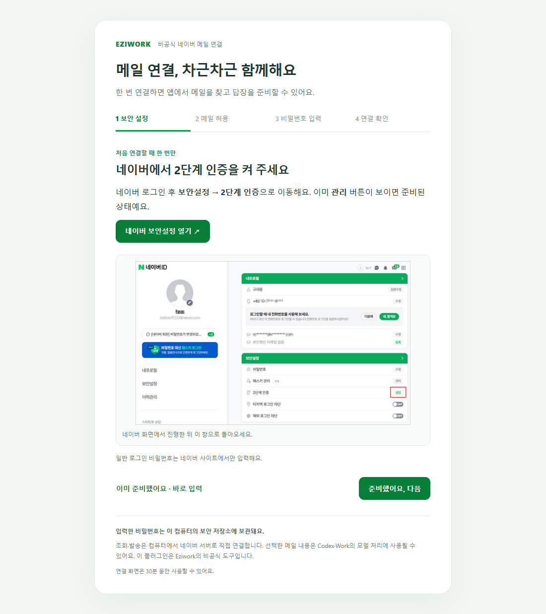
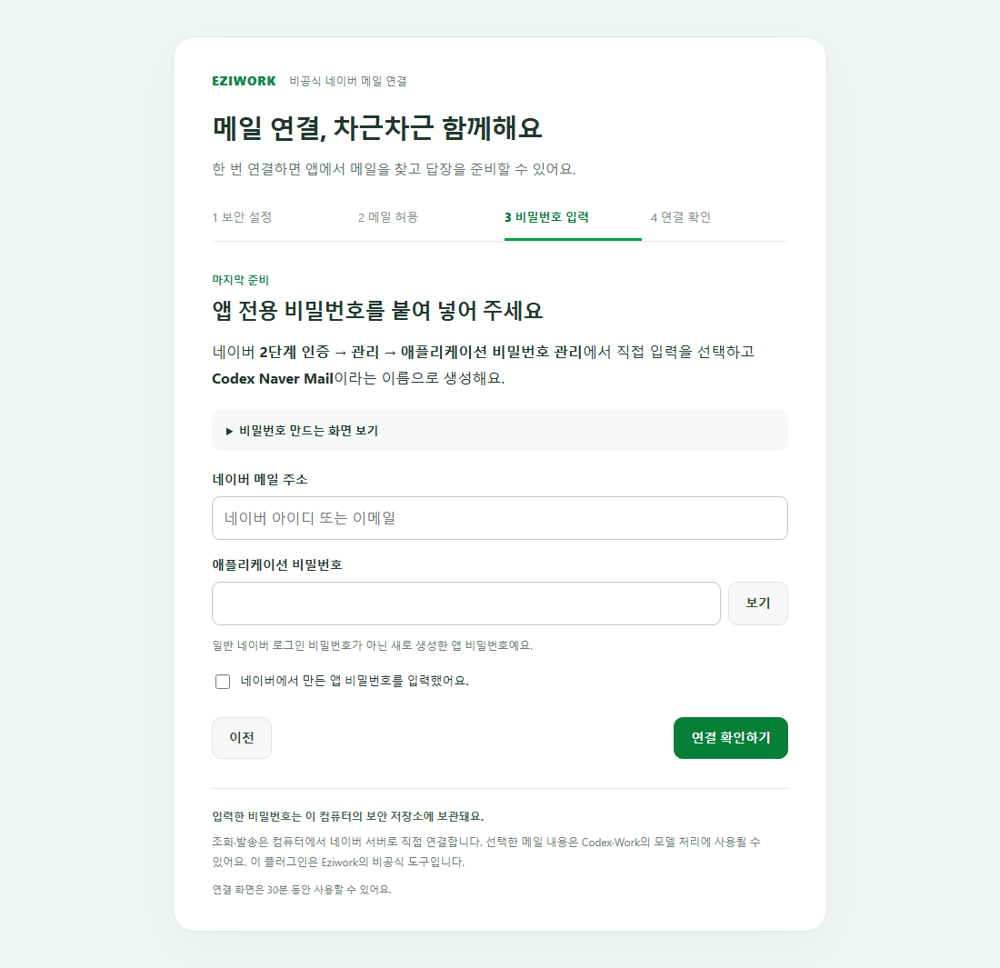
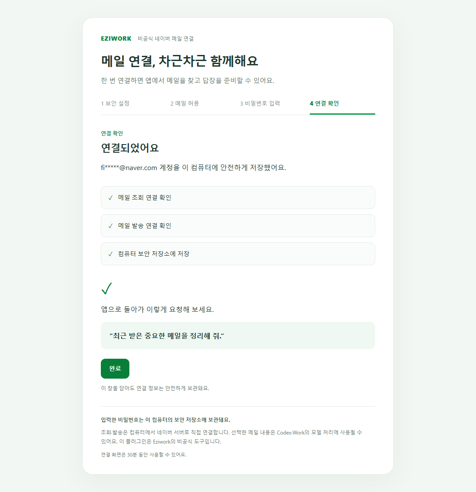

# 설치와 첫 연결 안내

[README로 돌아가기](../README.md) · [문제 해결](TROUBLESHOOTING.md)

이 플러그인을 연결하면 내 네이버 메일을 Codex 또는 로컬 MCP를 지원하는 데스크톱 Work에 부탁할 수 있습니다. 네이버 계정 하나를 연결하며, PC를 바꾸면 새 PC에서도 연결해야 합니다.

## 1. 가장 쉬운 설치: GitHub 주소 하나

처음 사용하는 분은 Codex 또는 로컬 MCP를 지원하는 데스크톱 Work에 아래 두 줄을 그대로 붙여 넣으세요.

```text
https://github.com/eziwork/naver-mail
이 플러그인을 설치해 줘.
```

지원되는 호스트는 저장소의 최신 **Release**를 확인해 현재 운영체제·CPU에 맞는 운영 패키지를 자동으로 고릅니다. 이어서 파일별 `.sha256` 또는 `SHA256SUMS.txt`의 SHA-256 값이 일치하는지 확인하고, 압축을 풀어 완성된 폴더를 로컬 플러그인 목록에 등록합니다. 기존 플러그인 설정은 유지하며, 설치 과정에서 네이버 비밀번호를 묻지 않습니다. 설치가 끝나면 앱을 다시 열거나 새 작업을 시작하라는 안내가 표시됩니다.

이 저장소의 **Code → Download ZIP**과 Releases의 **Source code**는 개발용 소스입니다. 일반 설치에는 실행 파일·고정 Node 런타임·OS별 키링 모듈이 들어 있는 Release 운영 패키지가 필요합니다. Codex가 주소 설치를 처리할 때의 검증·복구 순서는 [GitHub 주소 설치 지침](INSTALL_FROM_GITHUB.md)을 따릅니다.

호스트가 GitHub 주소를 직접 설치하지 못하면 아래 수동 절차를 사용하세요.

[0.2.0 다운로드 페이지](https://github.com/eziwork/naver-mail/releases/tag/v0.2.0)를 열고 **Assets**에서 아래 파일을 선택하세요. `.sha256`은 파일 검사값이며 설치 파일이 아닙니다.

| 내 컴퓨터 | 받을 파일 | 확인 방법 |
| --- | --- | --- |
| 일반적인 64비트 Windows PC | `naver-mail-0.2.0-win32-x64.zip` | 설정 → 시스템 → 정보 → 시스템 종류에서 x64 확인 |
| M1·M2·M3 등 Apple 칩 Mac | `naver-mail-0.2.0-darwin-arm64.tar.gz` | Apple 메뉴 → 이 Mac에 관하여 → 칩 |
| Intel Mac | `naver-mail-0.2.0-darwin-x64.tar.gz` | 이 Mac에 관하여 → 프로세서에 Intel 표시 |

Windows ARM64의 네이티브 지원은 검증하지 않았습니다. Mac 패키지는 실제 기기 검증과 서명·공증이 남아 있는 시험용입니다. 운영체제가 실행을 차단하면 [해결 안내](TROUBLESHOOTING.md)를 확인하세요.

다운로드한 파일의 압축을 풀면 `naver-mail` 폴더가 생깁니다. Windows에서는 파일을 우클릭한 뒤 **모두 압축 풀기**, Mac에서는 Finder에서 압축 파일을 열 수 있습니다. 폴더 이름을 유지하고 문서 폴더처럼 나중에도 보관할 위치로 옮깁니다.

패키지에는 메일 프로그램, OS에 맞는 키링 모듈, 고정 Node 런타임이 포함됩니다. Node·npm·Rust를 직접 설치할 필요가 없습니다. GitHub **Code → Download ZIP** 또는 Releases의 **Source code**는 개발용 원본이므로 일반 설치에 사용하지 않습니다.

## 2. 수동 설치에서 플러그인 등록하기

GitHub 저장소를 브라우저로 방문하는 것만으로 앱에 플러그인이 설치되지는 않습니다. 위의 자동 경로를 사용할 수 없는 앱 버전에서는 먼저 압축을 푼 폴더를 데스크톱 앱의 로컬 플러그인 목록에 등록합니다. Codex의 로컬 작업에서 다음 문장을 복사해 요청하세요. 꺾쇠 부분만 실제 폴더 위치로 바꿉니다.

```text
이 컴퓨터의 <압축을 푼 naver-mail 폴더 전체 경로>에 있는
Eziwork 네이버 메일 플러그인을 설치해 줘.
이미 빌드된 운영체제용 패키지이므로 npm 설치나 빌드는 하지 말고,
내 운영체제와 패키지가 맞는지, 실행 파일·런타임·키링 모듈이 있는지 확인해 줘.
기존 다른 플러그인 설정을 유지하면서 개인 플러그인 목록에 등록하고,
앱에서 설치할 수 있게 해 줘. 비밀번호는 지금 입력하지 않을게.
```

Windows에서는 압축을 푼 폴더를 열고 탐색기 주소창을 클릭하면 전체 경로를 복사할 수 있습니다. Mac에서는 Finder에서 폴더를 선택하고 Option 키를 누른 상태의 **경로 이름 복사**를 이용할 수 있습니다.

Codex가 등록을 마치면 안내에 따라 앱을 완전히 종료했다 다시 엽니다. **플러그인 → 개인/로컬 목록 → 네이버 메일**에서 설치하고 새 작업을 시작하세요. 메뉴 명칭은 앱 버전에 따라 다를 수 있습니다. 조직 정책으로 로컬 플러그인이 제한된 경우 조직 관리자에게 설치를 요청합니다.

이미 관리자가 배포한 목록에 네이버 메일이 보이면 목록에서 바로 설치하면 됩니다. 이 저장소의 개발 소스를 GitHub 마켓플레이스로 바로 추가하는 방식은 실행 파일과 런타임이 빠질 수 있어 일반 사용자용 경로가 아닙니다. 관리자용 등록 구조는 [개발 문서](DEVELOPMENT.md#로컬-앱에서-설치-검증하기)를 참고하세요.

## 3. 네이버 계정 연결하기

새 작업에서 **“네이버 메일 연결해 줘”**라고 입력합니다. 브라우저에 연결 안내가 열립니다. 주소는 `http://127.0.0.1:...`로 시작하며 내 컴퓨터 안에서만 접속하는 임시 화면입니다. 자동으로 열리지 않으면 대화에 제공된 연결 링크를 누릅니다. 이 링크에는 일회성 토큰이 있으므로 공유하지 않습니다.

### ① 네이버 보안 설정

안내의 네이버 보안 설정 바로가기를 눌러 네이버에서 로그인하고 2단계 인증을 설정합니다. 네이버 로그인·인증은 네이버 화면에서 직접 진행합니다. 이미 사용 중이면 다음 단계로 갑니다.



### ② 메일 연동 허용

네이버 메일의 **환경설정 → POP3/IMAP 설정 → IMAP/SMTP 설정**에서 IMAP/SMTP 사용을 허용하고 저장합니다. 플러그인은 메일 조회에 IMAP, 발송에 SMTP를 사용합니다. POP3 옵션은 별도 도움말에 있으며, 이 플러그인의 조회 방식은 IMAP입니다.

네이버 화면이나 연결 요건이 바뀌면 [네이버 공식 IMAP/SMTP 안내](https://help.naver.com/service/30029/contents/21344?osType=COMMONOS)를 우선 확인하세요.

### ③ 앱 비밀번호 입력

네이버 2단계 인증 관리에서 이 연결에 사용할 **애플리케이션 비밀번호**를 만듭니다. 앱 비밀번호는 일반 네이버 로그인 비밀번호와 별개입니다. 발급 과정은 [네이버 공식 앱 비밀번호 안내](https://help.naver.com/service/5640/contents/8584?lang=ko)를 참고하세요.

플러그인의 로컬 연결 화면으로 돌아와 `아이디@naver.com` 주소와 앱 비밀번호를 입력합니다. 이미 준비된 사용자는 첫 화면의 빠른 입력 경로를 이용할 수 있습니다.



비밀번호를 대화, 공개 이슈, 파일에 붙여 넣지 마세요. 플러그인은 비밀번호를 대화나 브라우저 저장소에 기록하지 않습니다. 제출 후 비밀번호 입력란도 비웁니다.

### ④ 연결 확인과 완료

| 화면에 표시되는 단계 | 확인하는 내용 |
| --- | --- |
| 메일 조회 연결 | 네이버 IMAP 서버에 로그인할 수 있는지 |
| 발송 연결 | 네이버 SMTP 서버에서 발송 인증을 할 수 있는지 |
| 안전한 저장 | Windows 자격 증명 관리자 또는 macOS 키체인에 저장되는지 |

연결 검사에서는 실제 메일을 보내지 않습니다. 모든 단계가 끝나고 완료가 표시되면 Codex/Work로 돌아옵니다. Mac에서 키체인 접근 요청이 나타나면 요청한 프로그램과 작업을 확인합니다.



연결 화면의 유효기간은 30분입니다. 오래 열어 두어 만료되었다면 대화에서 다시 연결 화면을 열어 달라고 요청하세요. 연결 오류는 [문제 해결](TROUBLESHOOTING.md)의 원인별 안내를 확인합니다.

## 4. 메일을 조회하고 정리하기

처음에는 **“네이버 메일 연결 상태를 실제로 확인해 줘”**로 연결을 확인한 다음 **“받은메일함 최근 메일 10개를 보여 줘”**라고 요청해 보세요.

- 검색은 제목·발신자 등 목록부터 반환합니다. 본문은 필요한 메일을 선택한 뒤 읽습니다.
- 본문을 읽어도 읽음 표시가 바뀌지 않습니다. 바꾸려면 “읽음으로 표시해 줘”라고 별도로 요청합니다.
- 같은 메일함의 본문을 한 번에 최대 10개까지 읽을 수 있습니다.
- 첨부파일은 다운로드 폴더의 `Naver Mail Attachments`에 저장합니다. 저장이 끝나면 파일 위치를 안내합니다.
- HTML 메일의 외부 이미지와 스크립트는 실행하지 않습니다. 메일 속 링크는 기본적으로 숨깁니다.

선택한 메일 내용은 요약·분석을 위해 AI에 전달될 수 있습니다. 회사 메일을 다룬다면 조직의 AI 사용 정책에 맞게 필요한 메일만 요청하세요.

## 5. 메일 보내기

예를 들어 “담당자에게 회의 일정을 확인하는 메일을 작성하고 전체 내용을 보여 줘”라고 요청합니다. 보내는 주소와 받는 사람·참조·숨은 참조, 제목, 본문 전체, 첨부파일을 검토하세요. 바꾸고 싶으면 수정부터 요청합니다.

내용이 맞으면 **다음 메시지에서 “이 내용으로 보내 줘”**라고 확인합니다. 발송 준비만으로 메일이 발송되지는 않습니다. 준비한 내용은 10분 뒤 만료되며, 그 이후에는 새 미리보기가 필요합니다.

| 발송 결과 | 의미와 다음 행동 |
| --- | --- |
| 발송 성공 | SMTP 서버가 모든 수신자를 접수했습니다. 최종 수신함 도착을 보장하는 뜻은 아닙니다. |
| 일부 수신자 거절 | 접수된 주소와 거절된 주소가 구분됩니다. 전체 수신자에게 다시 보내면 중복될 수 있습니다. |
| 수신자 거절 / 명확한 오류 | 안내된 주소나 인증 문제를 해결하고 새로운 미리보기를 만듭니다. |
| 결과 확인 불가 | 통신이 끊겨 접수 여부를 알 수 없습니다. 보낸메일함·수신 여부를 먼저 확인하세요. 자동 재발송하지 않습니다. |

일반 텍스트 메일을 보내며, 첨부파일은 최대 10개·합계 20 MiB입니다. 네이버 웹의 임시보관함에 초안을 저장하는 기능이나 예약 발송 기능은 없습니다.

## 6. 업데이트, 계정 변경, 삭제

업데이트 전에 기존 압축 패키지를 보관합니다. 새 버전 패키지로 플러그인 등록 위치를 갱신하고 앱에서 다시 설치한 뒤, 앱을 완전히 종료했다 새로 시작합니다. 계정 정보는 OS 보안 저장소에 있어 기존 저장 형식을 유지하는 업데이트에서는 그대로 사용합니다. 재시작하면 발송 준비 내용은 사라집니다.

다른 계정으로 바꾸려면 **“네이버 메일 계정을 다시 연결해 줘”**라고 요청합니다. 새 계정 저장이 완료되면 이전 발송 계획이 무효화됩니다.

사용을 그만두려면 먼저 **“네이버 메일 연결 해제해 줘”**라고 요청한 다음 플러그인을 제거하세요. 플러그인 제거만으로 OS 보안 저장소의 계정 정보가 삭제되는 것은 아닙니다. 네이버 보안 설정에서도 해당 앱 비밀번호를 삭제하면 네이버 측 접근을 폐기할 수 있습니다.

## 궁금한 점

**컴퓨터가 꺼져 있어도 메일을 확인하나요?** 로컬 프로그램이므로 컴퓨터와 해당 앱이 실행 중이어야 합니다. 새 메일을 계속 감시하지 않습니다.

**왜 작업 관리자에 Node가 잠깐 보이나요?** 요청을 처리하는 작업 프로세스입니다. 작업·설정 화면·발송 준비가 끝난 뒤 30초 유휴 상태가 지나면 자동 종료됩니다.

**Eziwork가 내 메일을 볼 수 있나요?** 이 플러그인은 Eziwork 서버에 연결 정보를 보내거나 메일을 수집하지 않습니다. 요청 결과를 받은 AI 서비스에는 해당 서비스의 데이터 정책이 적용됩니다.

**스마트폰이나 웹 Work에서도 쓸 수 있나요?** 0.2.0은 로컬 데스크톱 환경용입니다. 웹·클라우드 실행 환경과 모바일은 이번 지원 범위에 포함하지 않습니다.

설치 방식의 기준은 [OpenAI 플러그인 패키징 안내](https://developers.openai.com/plugins/build/plugins), 앱에서의 목록·설치 흐름은 [OpenAI 플러그인 안내](https://learn.chatgpt.com/docs/plugins)를 참고했습니다.
